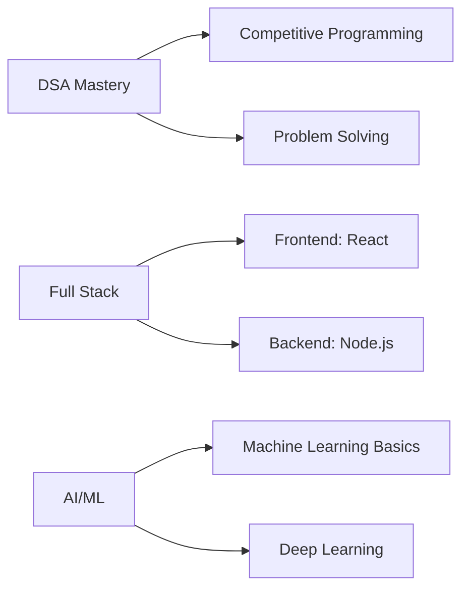

<div align="center">

# 👋 Hey there, I'm Nithin T!

### 🚀 Aspiring Software Developer | DSA Enthusiast | AI Explorer


[](https://github.com/your-username)
[](https://linkedin.com/in/your-profile)
[](mailto:your.email@example.com)


</div>

---

## 🧑‍💻 About Me

```java
public class Nithin {
    String name = "Nithin T";
    String location = "India 🇮🇳";
    String currentFocus = "DSA + Full Stack + AI";
    String[] learning = {"Data Structures", "Algorithms", "AI/ML", "Web Development"};
    String funFact = "Debugging is my cardio! 💪";
    
    public void sayHi() {
        System.out.println("Thanks for dropping by! Let's build something cool together!");
    }
}
```

- 🎓 Computer Science Student passionate about technology
- 💡 Currently mastering **Data Structures & Algorithms with Java**
- 🤖 Exploring the fascinating world of **Artificial Intelligence**
- 🌐 Learning **Full Stack Development** to bring ideas to life
- 🔥 Love solving problems and building practical projects
- 🎯 Goal: Write clean code and contribute to open source
- ⚡ Fun fact: I can spend hours optimizing code for O(n) complexity!

---

## 🛠️ Technologies & Tools

### Programming Languages


### Web Development


### Tools & Platforms


### Currently Learning


---

## 📊 GitHub Stats

<div align="center">


</div>

---

## 🎯 What I'm Focusing On



### 📚 Current Learning Path
- ✅ **Data Structures**: Arrays, Linked Lists, Stacks, Queues, Trees, Graphs
- ✅ **Algorithms**: Sorting, Searching, Dynamic Programming, Greedy, Backtracking
- 🔄 **Full Stack**: HTML, CSS, JavaScript, React, Node.js, Express, MongoDB
- 🔄 **AI/ML**: Python libraries, Neural Networks, TensorFlow basics
- 📝 **Computer Networks**: Routing algorithms, Network protocols

---

## 💼 Projects

### 🌟 Featured Projects

<table>
  <tr>
    <td width="50%">
      <h3 align="center">Bellman-Ford Network Simulator</h3>
      <div align="center">  
        <a href="https://github.com/your-username/bellman-ford-network-simulator">
          
        </a>
        <p><strong>Java, Computer Networks</strong> - Network routing simulation with PAN/HAN implementation</p>
      </div>
    </td>
    <td width="50%">
      <h3 align="center">DSA Practice Repository</h3>
      <div align="center">  
        <a href="https://github.com/your-username/dsa-practice">
          
        </a>
        <p><strong>Java, C++</strong> - Solutions to 100+ DSA problems with detailed explanations</p>
      </div>
    </td>
  </tr>
</table>

### 🚀 Other Projects
- 📱 **Portfolio Website** - Personal portfolio built with React
- 🤖 **ChatBot** - AI-powered chatbot using Python
- 🎮 **Game Development** - Simple games using Java/JavaScript
- 📊 **Data Visualizer** - Interactive data visualization tool

---

## 🏆 Achievements & Goals

### 🎖️ Milestones
- ✅ Solved 50+ DSA problems on various platforms
- ✅ Built first full-stack web application
- ✅ Completed Java programming fundamentals
- ✅ Started contributing to open source
- 🎯 Goal: Solve 200+ DSA problems by end of 2025
- 🎯 Goal: Build 5 full-stack projects
- 🎯 Goal: Contribute to 10 open source projects

---

## 📈 Contribution Graph

<div align="center">


</div>

---

## 💻 Coding Activity

<div align="center">

<!--START_SECTION:waka-->
```text
Java         ████████████░░░░   45.2%
JavaScript   ████░░░░░░░░░░░░   22.1%
Python       ███░░░░░░░░░░░░░   18.3%
C++          ██░░░░░░░░░░░░░░   10.4%
Others       █░░░░░░░░░░░░░░░   4.0%
```
<!--END_SECTION:waka-->

</div>

---

## 🎓 Learning Resources I Love

- 📺 **YouTube Channels**: CodeWithHarry, Apna College, freeCodeCamp
- 📚 **Books**: Cracking the Coding Interview, Clean Code
- 🌐 **Platforms**: LeetCode, GeeksforGeeks, HackerRank, Coursera
- 💡 **Blogs**: Medium, Dev.to, GeeksforGeeks

---

## 🤝 Let's Connect!

<div align="center">

I'm always excited to collaborate on interesting projects or just have a tech chat!

[](https://linkedin.com/in/your-profile)
[](https://twitter.com/your-handle)
[](https://instagram.com/your-handle)
[](https://leetcode.com/your-username)
[](https://auth.geeksforgeeks.org/user/your-username)

**Email:** your.email@example.com

</div>

---

## 💬 Random Dev Quote

<div align="center">


</div>

---

## 🎮 When I'm Not Coding...

- 🎵 Listening to music while debugging
- 📖 Reading tech blogs and staying updated
- 🎯 Solving puzzles and brain teasers
- 🏃 Keeping fit (debugging IRL bugs!)
- 🎬 Watching tech talks and tutorials

---

<div align="center">

### 🚀 "Code is like humor. When you have to explain it, it's bad." - Cory House

### 📊 Profile Stats


---

### ⚡ Quick Stats


---

**Thanks for visiting my profile! Feel free to reach out for collaborations or just a friendly chat! 😊**


*Last Updated: October 2025*

</div>
