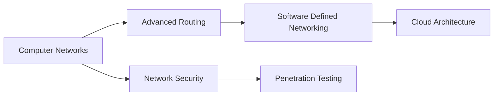

<div align="center">
  
# 👋 Hi, I'm [Your Name]

### 💻 Computer Science Student | Network Engineer | Java Developer


[](https://your-portfolio.com)
[](https://linkedin.com/in/your-profile)
[](https://twitter.com/your-handle)
[](mailto:your.email@example.com)


</div>

---

## 🚀 About Me

```javascript
const aboutMe = {
    name: "Your Name",
    location: "Bengaluru, India 🇮🇳",
    education: "Computer Science Engineering",
    currentFocus: "Computer Networks & Distributed Systems",
    interests: ["Network Protocols", "System Design", "Cloud Computing"],
    funFact: "I debug network issues faster than I debug my life choices 😄"
};
```

- 🎓 Pursuing **B.Tech in Computer Science** at [Your University]
- 🔭 Currently working on **Network Routing Simulations**
- 🌱 Learning **Advanced Networking Protocols** and **Cloud Architecture**
- 💡 Interested in **Distributed Systems** and **IoT Networks**
- 🎯 2025 Goals: Contribute to **Open Source** and Build **Real-World Projects**
- ⚡ Fun fact: I can explain **Bellman-Ford algorithm** in my sleep!

---

## 🛠️ Tech Stack

### Languages


### Frameworks & Libraries


### Networking & Systems


### Tools & Platforms


### Databases


---

## 📊 GitHub Stats

<div align="center">
  


</div>

---

## 🏆 GitHub Trophies

<div align="center">
  


</div>

---

## 📈 Contribution Graph

<div align="center">


</div>

---

## 🔥 Featured Projects

<div align="center">

[](https://github.com/your-username/bellman-ford-network-simulator)

[](https://github.com/your-username/network-analyzer)

</div>

### 🌟 Notable Projects

| Project | Description | Tech Stack | Stars |
|---------|-------------|------------|-------|
| [**Bellman-Ford Simulator**](https://github.com/your-username/bellman-ford-network-simulator) | Network routing algorithm simulation with PAN/HAN demos | Java, Networking | ⭐ |
| [**Packet Sniffer**](https://github.com/your-username/packet-sniffer) | Real-time network packet analyzer | Python, Scapy | ⭐ |
| [**Chat Application**](https://github.com/your-username/chat-app) | Real-time messaging with WebSocket | Node.js, React | ⭐ |
| [**IoT Dashboard**](https://github.com/your-username/iot-dashboard) | Smart home device monitoring | Python, Flask, MQTT | ⭐ |

---

## 💼 Experience & Education

### 🎓 Education
```
🏛️ [Your University Name]
   Computer Science & Engineering
   [Start Year] - [End Year]
   CGPA: X.XX/10
```

### 💻 Experience
```
🔹 Network Engineering Intern - [Company Name]
   [Month Year] - [Month Year]
   • Implemented routing protocols in test environments
   • Analyzed network traffic patterns
   • Optimized network performance by 20%

🔹 Software Development Intern - [Company Name]
   [Month Year] - [Month Year]
   • Developed backend APIs using Spring Boot
   • Integrated database systems
   • Collaborated with cross-functional teams
```

---

## 📜 Certifications

- 🏅 **CCNA** - Cisco Certified Network Associate *(In Progress)*
- 🏅 **AWS Cloud Practitioner** - Amazon Web Services
- 🏅 **Java Programming** - Oracle Certified Associate
- 🏅 **Data Structures & Algorithms** - Coursera

---

## 🎯 Current Learning Path



---

## 📝 Latest Blog Posts

<!-- BLOG-POST-LIST:START -->
- [Understanding Bellman-Ford Routing Algorithm](https://your-blog.com/bellman-ford)
- [Building Your First Network Simulator in Java](https://your-blog.com/network-sim)
- [PAN vs HAN: Understanding Personal and Home Networks](https://your-blog.com/pan-vs-han)
- [Quality of Service in Modern Networks](https://your-blog.com/qos)
<!-- BLOG-POST-LIST:END -->

---

## 🎨 Coding Activity

<!--START_SECTION:waka-->
```text
Java         12 hrs 30 mins  ████████████░░░░░   48.2%
Python       5 hrs 15 mins   ████░░░░░░░░░░░░░   20.3%
JavaScript   4 hrs 45 mins   ███░░░░░░░░░░░░░░   18.4%
SQL          2 hrs 10 mins   ██░░░░░░░░░░░░░░░   8.4%
Markdown     1 hr 15 mins    █░░░░░░░░░░░░░░░░   4.7%
```
<!--END_SECTION:waka-->

---

## 🤝 Connect With Me

<div align="center">

[](https://linkedin.com/in/your-profile)
[](https://twitter.com/your-handle)
[](https://instagram.com/your-handle)
[](https://your-portfolio.com)
[](https://dev.to/your-username)
[](https://medium.com/@your-username)
[](https://stackoverflow.com/users/your-id)
[](https://leetcode.com/your-username)

</div>

---

## 💡 Quote of the Day

<div align="center">


</div>

---

## 🎮 Fun Zone

<div align="center">

### 🐍 Watch the Snake eat my contributions!


</div>

---

## 📫 How to Reach Me

```python
def contact_me():
    contact_info = {
        "email": "your.email@example.com",
        "linkedin": "linkedin.com/in/your-profile",
        "twitter": "@your-handle",
        "location": "Bengaluru, India",
        "availability": "Always open to interesting conversations!"
    }
    return contact_info

# Feel free to reach out! 👋
```

---

<div align="center">

### 💖 Support My Work

If you like my projects, consider buying me a coffee! ☕

[](https://buymeacoffee.com/your-username)

</div>

---

<div align="center">

### ⚡ "Code is like humor. When you have to explain it, it's bad." - Cory House


**Thanks for visiting! 🚀 Let's build something amazing together!**


</div>
